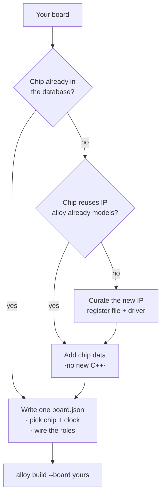

# Adding a board

alloy is built so that **a new board is data, not code**. There are two cases, in increasing
order of effort.



## Case 1 — the chip is already supported

If your board uses a chip alloy already ships (any STM32G0/F7, RP2040, SAM E70, ESP32…), you
only write **one `board.json`**. Drop it in `boards/<your-board>/board.json`:

```json
{
  "schema": "alloy.board.v1",
  "id": "my_board",
  "chip": "st/stm32g071rb",
  "clock_profile": "pll_64mhz",
  "roles": {
    "led":        { "pin": "pa5", "active": "high" },
    "debug_uart": { "peripheral": "usart2", "tx": "pa2", "rx": "pa3", "baud": 115200 }
  },
  "probe": { "kind": "stlink", "runner": "openocd" }
}
```

Then build — the pin routes are checked at compile time, so a wrong pin fails loudly:

```console
$ alloy build --board my_board
```

That's it. No C++, no CMake.

## Case 2 — a new chip in a known family

alloy separates **facts** (addresses, register offsets, pin routes, IRQ numbers — generated
from data) from **behavior** (drivers — hand-written, reused across chips). If your chip reuses
a peripheral IP alloy already curates, you add a **chip data file** and reuse the existing
drivers — still zero new C++.

Chip data lives in the sibling [`alloy-devices`](https://github.com/Alloy-Embedded/alloy-devices)
repository and looks like this (abridged):

```yaml
schema: alloy.chip.v1
vendor: st
part: STM32G071RB
cores: [{ arch: armv6m }]
memories:
  - { kind: flash, base: '0x08000000', size: 131072 }
  - { kind: ram,   base: '0x20000000', size: 36864 }
peripherals:
  usart2: { ip: st/usart_v4, base: '0x40004400', irq: USART2, gate: { ... } }
routes:
  - { pin: pa2, peripheral: usart2, signal: tx, kind: af_fixed, af: 1 }
```

The database is **schema-validated and plausibility-linted before any code is generated**, so a
bad address or a dangling reference fails generation with a readable message — never the compile,
never the device.

## Case 3 — a brand-new peripheral IP

Only when a chip has a peripheral IP nobody has curated yet do you write C++: a curated register
file (data) plus **one driver per IP version**, selected by a type tag:

```cpp
template <class Inst>
    requires std::same_as<typename Inst::ip, alloy::ip::st::usart_v4>
struct uart_impl<Inst> { /* the sequencing behavior, once, for this IP */ };
```

Every chip that reuses that IP then costs data only. This is how the framework scales breadth
cheaply — the guiding rule is **facts are generated, behavior is hand-written**.

!!! tip "Depth before breadth"
    A board is only called *supported* once CI compiles `blink` + `uart_echo` for it. Prefer a
    handful of boards that fully work over a long list that half-works.
