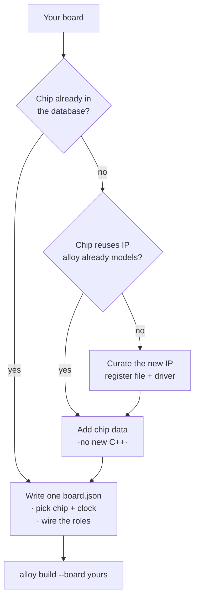

# Adding a board

alloy is built so that **a new board is data, not code**. There are two cases, in increasing
order of effort.



## Case 1 — the chip is already supported

If your board uses a chip alloy already ships (any STM32G0/F7, RP2040, SAM E70, ESP32…), you
only write **one `board.json`**. Drop it in `boards/<your-board>/board.json`:

```json
{
  "schema": "alloy.board.v1",
  "id": "my_board",
  "chip": "st/stm32g071rb",
  "clock_profile": "pll_64mhz",
  "roles": {
    "led":        { "pin": "pa5", "active": "high" },
    "debug_uart": { "peripheral": "usart2", "tx": "pa2", "rx": "pa3", "baud": 115200 }
  },
  "dma": {
    "debug_uart.rx": { "controller": "dma1", "channel": 2 },
    "debug_uart.tx": { "controller": "dma1", "channel": 3 }
  },
  "probe": { "kind": "stlink", "runner": "probe-rs", "chip_id": "STM32G071RBTx" }
}
```

Then build — the pin routes are checked at compile time, so a wrong pin fails loudly:

<!-- docgate: placeholder my_board — the board this page is teaching you to write; it is not in boards/ and must not be -->
```console
$ alloy build --board my_board
```

That's it. No C++, no CMake.

### Hand out the DMA channels, or lose the streaming API

The `dma` block is easy to leave out and expensive to leave out. It is what makes
`uart.rx_ring()`, `adc.ring()`, `spi.transfer_dma()` and `uart.write_dma()` **exist** on your
board; omit it and every one of those methods is simply not declared, the folding examples print
their fallback branch forever, and nothing tells you why.

Each key is `<role>.<signal>`. Each value names a controller and a channel:

| The engine your peripheral rides | The key | Numbering |
| --- | --- | --- |
| A free router — STM32 G0/G4 (DMAMUX), SAM E70 (XDMAC) | `channel` | from 1 |
| A free router — RP2040 | `channel` | from 0 |
| ST's F4/F7 stream engines | `stream` | from 0, and only the `{controller, stream}` pairs the chip's own route table allows |

The base is not a rule to remember; it comes out of the chip data, and picking the wrong one is a
validation error that says so and lists what would work.

**What is deliberately *not* in the board file: the request id.** Which DMAMUX request, which
channel-select value, which DREQ number pairs that channel with that peripheral is a *chip* fact,
and it stays in the chip database. A board says "spi.rx gets channel 4"; it never says how the
silicon wires channel 4 to SPI1's receive signal.

`alloy board-validate` reports every problem at once, with the legal alternatives:

```console
$ alloy board-validate --file boards/my_board/board.json
error: dma.spi.miso: dma 'spi.miso': the chip states no DMA request for spi1 'miso'  (try: spi.rx, spi.tx)
error: dma.spi.tx: dma 'spi.tx': dma1 channel 3 already serves 'debug_uart.tx' — one channel moves one stream  (try: 5, 7)
warning: board: pa5 is used by led and led_pwm — only one of them can drive it at a time
```

Every problem, located, with a way out — the route `static_assert` moved to config time. Warnings
are for things that are legal but probably not what you meant.

!!! warning "An assignment is a promise the driver may not be able to keep"
    Validation checks your statement against the **chip's** routing data. It does not check that
    the peripheral **driver** has DMA entry points, so a perfectly legal assignment can be inert
    — three are, in the shipped boards. If you add a route and the method still does not appear,
    that is the reason, and [the availability table](dma.md#what-each-board-gives-you) says which
    of the four gates you hit.

The full treatment — the four shapes, what each engine can do, and how far each path is proven —
is **[Streaming data without the CPU](dma.md)**.

## Case 2 — a new chip in a known family

alloy separates **facts** (addresses, register offsets, pin routes, IRQ numbers — generated
from data) from **behavior** (drivers — hand-written, reused across chips). If your chip reuses
a peripheral IP alloy already curates, you add a **chip data file** and reuse the existing
drivers — still zero new C++.

Chip data lives in the sibling [`alloy-devices`](https://github.com/Alloy-Embedded/alloy-devices)
repository and looks like this (abridged):

```yaml
schema: alloy.chip.v1
vendor: st
part: STM32G071RB
cores: [{ arch: armv6m }]
memories:
  - { kind: flash, base: '0x08000000', size: 131072 }
  - { kind: ram,   base: '0x20000000', size: 36864 }
peripherals:
  usart2: { ip: st/usart_v4, base: '0x40004400', irq: USART2, gate: { ... } }
routes:
  - { pin: pa2, peripheral: usart2, signal: tx, kind: af_fixed, af: 1 }
```

The database is **schema-validated and plausibility-linted before any code is generated**, so a
bad address or a dangling reference fails generation with a readable message — never the compile,
never the device.

## Case 3 — a brand-new peripheral IP

Only when a chip has a peripheral IP nobody has curated yet do you write C++: a curated register
file (data) plus **one driver per IP version**, selected by a type tag:

```cpp title="illustrative: the shape of a driver specialisation — `uart_impl` is declared in alloy/hal, not here"
template <class Inst>
    requires std::same_as<typename Inst::ip, alloy::ip::st::usart_v4>
struct uart_impl<Inst> { /* the sequencing behavior, once, for this IP */ };
```

Every chip that reuses that IP then costs data only. This is how the framework scales breadth
cheaply — the guiding rule is **facts are generated, behavior is hand-written**.

!!! tip "Depth before breadth"
    A board is only called *supported* once CI compiles `blink` + `uart_echo` for it. Prefer a
    handful of boards that fully work over a long list that half-works.
