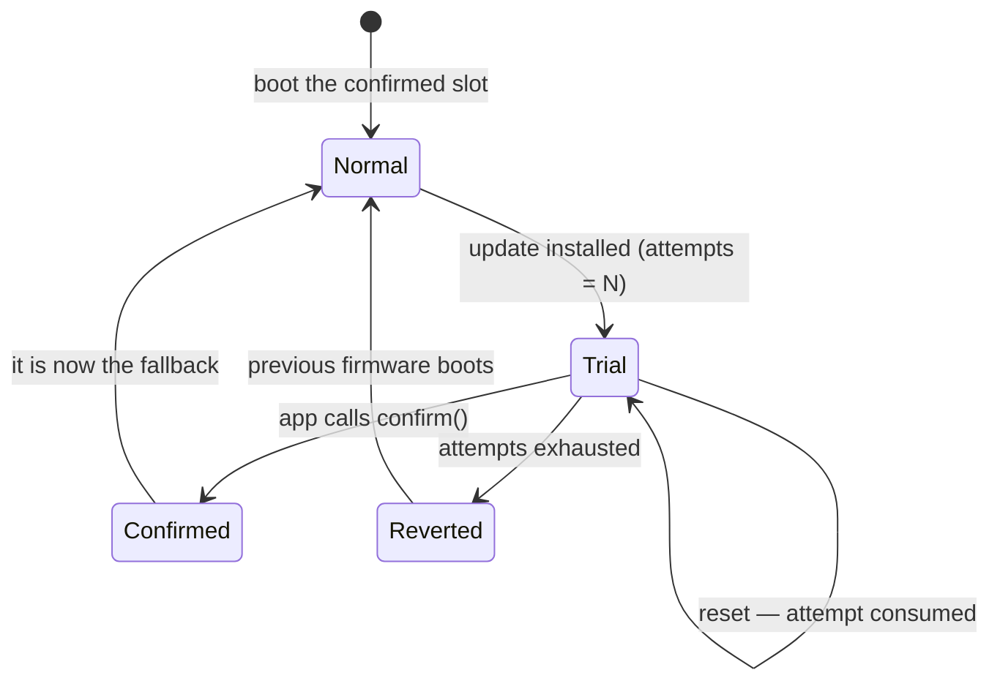

# Firmware update over UART

Shipping a product means being able to fix it after it leaves the building. alloy carries a
complete field-update path: a resident **bootloader**, two firmware **slots**, a **trial boot**
that rolls back on its own when the new firmware misbehaves, and optional **Ed25519 signing**.

Like everything else here, it is portable — the same bootloader source builds for every family
whose flash controller alloy models, and the slot layout is *computed from chip data*, never
hand-written.

```console
$ alloy keygen -o keys/update.key          # once, per product
$ alloy build --slot bl && alloy flash     # the bootloader, programmed with a probe
$ alloy image build/app.elf --set-version 2 --sign keys/update.key -o app_b.img
$ alloy update --image-b app_b.img --port /dev/tty.usbmodem1103
  42496/42496 B (100%)
update accepted -> slot B (device was running version 1); device now reboots
into a TRIAL boot — it must be confirmed to stick
```

## The layout comes from the chip data

Flash is partitioned into four regions. The CLI derives them from the flash size and the erase
granularity of the flash-controller IP — facts already in the device database — and emits them
as `alloy/slots.hpp`:

```
[ bootloader ][ slot A ][ slot B ][ boot-state store ]
```

| Board | Erase stride | Bootloader | Slot A | Slot B | Store |
| --- | --- | --- | --- | --- | --- |
| `nucleo_g071rb` (128 KB) | 2 KB page | 32 KB @ `0x08000000` | 46 KB @ `0x08008000` | 46 KB @ `0x08013800` | 4 KB |
| `nucleo_f722ze` (512 KB) | 128 KB sector | 32 KB @ `0x08000000` | 128 KB @ `0x08020000` | 128 KB @ `0x08040000` | 32 KB |
| `same70_xplained` (2 MB) | 8 KB block | 32 KB @ `0x00400000` | 1000 KB @ `0x00408000` | 1000 KB @ `0x00502000` | 16 KB |

Two decisions in that table are worth knowing about, because they are permanent once a device is
in the field:

!!! info "The bootloader region is 32 KB even when you don't sign"
    The UART bootloader itself is around 4 KB. Ed25519 verification costs ~14 KB more on
    Cortex-M0+. The region is sized for signing **whether or not a given build signs**, because
    the layout is baked into fielded devices: if turning signing on later moved the slots,
    already-deployed products could never accept the update that introduces it. Address space is
    cheap; a bricked fleet is not.

!!! info "No image swap — apps run from the slot they were written to"
    The active slot *is* the known-good fallback. An update lands in the other slot and boots
    from there directly. That removes the swap algorithm (and its power-loss states) entirely,
    at the cost of linking the app twice — see below.

The app's vector table sits at a fixed `0x200` offset inside its slot, so the updater can stream
`[header | payload]` straight into flash with the vectors landing where the bootloader's jump
expects them.

## Build the three binaries

```console
$ alloy build --slot bl      # the bootloader → its own region
$ alloy build --slot a       # your app, linked to run from slot A
$ alloy build --slot b       # the same app, linked to run from slot B
```

Because there is no swap, an app is position-dependent: it must be linked for the slot it will
execute in. You ship **both** builds, and `alloy update` picks the right one — the device says
which slot it is about to write in its `INFO` reply.

```console
$ alloy update --image-a app_a.img --image-b app_b.img --port /dev/ttyUSB0
```

Passing both is the safe form: if the device reports a slot you did not supply an image for, the
update stops before writing anything. A single image can be passed positionally, but then you are
asserting you already know the target slot — nothing cross-checks it, and the wrong one costs a
trial boot (the rollback saves the device; the update cycle is wasted).

## Pack an image

```console
$ alloy image build/app.elf --set-version 3 -o app_b.img
image: app_b.img  (42496 B = 32 B header + 42464 B payload, version 3)
```

`alloy image` accepts an ELF directly (it flattens it exactly the way `objcopy -O binary` does)
or a raw `.bin`, and wraps it in a 32-byte header:

| Offset | Field | Notes |
| --- | --- | --- |
| 0 | magic `"ALOY"` | fast-rejects erased (`0xFF`) flash |
| 4 | header version / size | lets the header grow without breaking old devices |
| 8 | `image_version` | monotonic — `--set-version`; **enforced**, see [anti-rollback](#anti-rollback) |
| 12 | `payload_length` | exact bytes to CRC; never CRC a whole slot |
| 16 | `payload_crc32` | integrity of the firmware itself |
| 20 | `flags` | reserved |
| 22 | `key_id` | which key of the device's ring signed this — `--key-id`, default 0 |
| 28 | `header_crc32` | so a corrupt header is rejected *before* its length is trusted |

Two independent CRCs is not belt-and-braces: the header CRC is what makes `payload_length`
trustworthy enough to use as a bound.

## Trial, confirm, rollback

A new image is armed as a **one-shot trial**. The bootloader consumes one attempt *before*
jumping, so a firmware that hangs cannot retry forever. The app must call `confirm()` after its
own health check; if it never does, the bootloader reverts to the previous firmware.



The whole state — active slot, pending slot, attempts left — packs into one 32-bit word, so any
transition commits in a **single store write**. There is no half-updated state to tear, and the
store itself is a two-page ping-pong whose write leaves the previous value authoritative if power
drops mid-write.

On the app side that is three lines ([`examples/ota_app`](https://github.com/Alloy-Embedded/alloy/tree/main/examples/ota_app)):

```cpp
using flash_hal = alloy::hal::flash_impl<alloy::slots::flash_ctrl_t>;
alloy::ota::boot_store<flash_hal> store{flash_hal{}, alloy::slots::store_base,
                                        alloy::slots::store_page_b};
alloy::ota::boot_manager mgr{store};
if (mgr.confirm()) { uart.write("confirmed\r\n"); }   // idempotent on normal boots
```

!!! warning "Reaching `main()` is not health"
    `confirm()` is a promise that *this firmware works*. Call it after the check that would
    actually catch a bad build — the sensor answered, the radio associated, the calibration
    loaded. Confirming at the top of `main()` gives you the ceremony of rollback with none of the
    protection.

### A hung trial is a reset, not a wedge

Attempts are only consumed across resets, so firmware that hangs without crashing would sit there
forever. The bootloader closes that gap: before a **trial** jump — and only a trial jump — it
arms the hardware watchdog.

```cpp
if constexpr (board::caps::watchdog) { board::watchdog.start(std::chrono::seconds{2}); }
```

A healthy app confirms and keeps feeding. A hung one is reset, consumes an attempt, and the fleet
rolls back on its own with nobody pressing anything. Confirmed boots are *not* armed by the
bootloader — that is the product's policy, not the bootloader's.

## Anti-brick doctrine

Four rules, all enforced in the bootloader rather than documented and hoped for:

1. **Verify what you boot, not just what you wrote.** The slot is verified again at boot, with
   the same code path the updater used.
2. **A trial that fails verification is rejected immediately**, not retried until attempts run
   out.
3. **If nothing verifies, stay in update mode.** A blank or fully corrupt board keeps listening
   on the same wire it was updated over — there is no state that requires a probe to escape.
4. **Verify then arm, in that order.** A crash between the two leaves `pending == none`, so the
   confirmed firmware still boots.

## Signing

Integrity (CRC) proves the image arrived intact. It proves nothing about *who sent it*. If your
update path is a service technician's laptop, a phone app, or anything reachable by someone you
have not met, sign the images.

=== "1. Make a keypair"

    ```console
    $ alloy keygen -o keys/update.key
    private key: keys/update.key  (0600 — KEEP THIS SECRET AND BACKED UP: lose it
    and fielded devices can never be updated again)
    public key:  keys/update.pub
    ```

=== "2. Tell the project its public key"

    ```toml title="alloy.toml"
    [ota]
    public_key = "keys/update.pub"
    ```

    Codegen bakes it into `alloy/ota_key.hpp`. The header is emitted either way, so firmware
    selects the policy with `if constexpr (alloy::ota_key::configured)` — no `#ifdef`, in
    keeping with the rest of the framework.

=== "3. Sign each image"

    ```console
    $ alloy image build/app.elf --set-version 3 --sign keys/update.key -o app_b.img
    ```

The signature is an Ed25519 trailer over exactly the bytes the device already verifies
(header + payload), using [Monocypher](https://monocypher.org/). Nothing about the v1 image
format changed, so the format did not fork when signing arrived.

A signing-enabled device refuses an unsigned or wrongly-signed image **on the wire** — the
operator sees a NAK — rather than accepting it and burning a trial boot on firmware it was never
going to run.

!!! danger "Keep the private key out of the repository"
    `alloy keygen` writes the private key with a `.pub` sibling; commit only the `.pub`. Anyone
    holding the private key can update every device that trusts it.

## Anti-rollback

A signature cannot catch a **downgrade**. A replayed old image is one the vendor really did
sign, so every crypto check passes; the attacker's move is to push last year's firmware to
reopen a bug you fixed. Only a version policy stops that, and alloy enforces one.

**The rule.** At the moment it would *accept* an image, the device refuses anything whose
`image_version` is below the highest version it can prove it already holds — the floor is the
running firmware's version, raised by whatever verifies in the slot about to be overwritten.
The refusal is a NAK carrying `ota_error::rollback`, which `alloy update` prints in words.

```console
$ alloy update --port /dev/ttyUSB0 old_v1.img
error: device rejected update (ota_error 11: rollback — the device already holds a version at
or above this image's, and refuses the downgrade. Re-issue with a higher --set-version. The
target slot was rewritten and is now garbage; the running firmware is untouched)
```

**Why it survives power loss.** There is no new persistent record to tear: the floor is derived
from the *slots themselves*, which is the same flash the boot-state's guarantees already rest
on. After an automatic rollback moves the device back to the older slot, the newer image is
still sitting in the other slot, so the floor does not drop.

!!! warning "Read these three limits before you rely on it"
    - **It is an accept-time rule, never a boot-time one.** A confirmed *older* slot stays
      bootable forever — deliberately. The anti-brick fallback is "if the planned slot does not
      verify, boot the other one", and after any update the other one is by definition older. A
      boot-time floor would refuse exactly the fallback that keeps devices alive.
    - **A device on which neither slot verifies has a floor of 0** and accepts anything. That is
      required: a blank or bricked board must always be recoverable. So the claim is *a working
      device refuses a downgrade*, not *a device refuses a downgrade*.
    - **The refusal happens at FINISH**, after the image has already been streamed and the
      inactive slot erased. The running firmware is untouched and nothing is armed, but the
      operator is left with a garbage inactive slot. The NAK text says so.

## Key rotation and revocation

One baked-in public key is a single point of failure for the whole fleet: the day it leaks,
every device trusts the attacker. A device can instead trust a small **ring** of keys, and the
image header's `key_id` says which one signed it.

```toml title="alloy.toml"
[ota]
public_keys = ["retired", "keys/rotate.pub"]   # key_id 0 retired, key_id 1 live
```

```console
$ alloy image build/app.elf --set-version 4 --sign keys/rotate.key --key-id 1 -o app_b.img
```

The ring is **positional**: entry *i* is what `--key-id i` selects. A key is retired by
replacing its entry with `"retired"`, never by deleting it — deleting entry 0 would silently
re-point every image that names key 0 at what used to be key 1. A retired entry is emitted as 32
zero bytes and is refused before Ed25519 is ever called. Codegen refuses a ring that is empty,
entirely retired, or contains the same key twice (retiring one of a duplicate pair would quietly
do nothing).

Exactly **one** signature check runs regardless of ring size — `key_id` selects a key, it never
triggers a try-every-key sweep, and it is inside both the header CRC and the signed bytes, so it
cannot be re-pointed by an attacker.

Backward compatibility is by construction: `key_id` occupies the `reserved` u16 that every image
ever produced wrote as zero, so old images select ring entry 0 and `header_version` stays 1.
`public_key = "..."` still works and means a ring of one.

!!! danger "Revocation requires shipping a new bootloader — say it plainly"
    The ring is `.rodata`, baked in at build time. Retiring a key takes effect only on devices
    that *receive the bootloader containing the new ring*, which must itself be signed by a key
    they already trust. There is no over-the-air revocation message, because a revocation floor
    would need persistent state `ota::boot_store` cannot hold (it stores exactly one `u32`).
    Until the new bootloader lands, a device keeps trusting the leaked key. Plan the rotation
    *before* you need it: ship a second key in the ring while the first is still healthy.

### What signing, versioning and rotation do and do not buy you

| Threat | Covered? |
| --- | --- |
| Corrupted transfer | Yes — CRC, before any signature work |
| Attacker-authored firmware | Yes — they cannot produce a valid signature |
| Tampering with an image in transit, CRCs repaired | Yes — this is a CI test case |
| Replaying an **older, genuinely signed** image | Yes — refused with `ota_error::rollback`, on a device that has a working slot to derive a floor from ([limits](#anti-rollback)) |
| Key compromise | Partly — a ring lets a leaked key be retired without bricking the fleet, but retiring it requires shipping a new **bootloader**; there is no field revocation |
| Per-device keys (one compromised unit ≠ the fleet) | No — alloy has no RNG/TRNG HAL, so a per-device keypair would have to be generated on the host, which means the host held the private half |
| Reading firmware off the device | No — signing is authenticity, not confidentiality (see `alloy secure` for RDP) |

## The wire protocol

Stop-and-wait, every frame CRC-32 guarded, and deliberately dull:

```
SOF 0x7E | type u8 | seq u8 | len u16 | payload[len] | crc32 u32
                     └────── crc32 covers type..payload ──────┘

host → device:  HELLO · DATA · FINISH
device → host:  INFO  · ACK  · NAK
```

The device is a pure responder — **all** retransmission policy lives in the host. A duplicate
`DATA` sequence number (a retransmit after a lost ACK) is re-ACKed without rewriting flash;
anything else out of order is NAKed. A fresh `HELLO` restarts the session, which is what makes a
host retry after a power blip mid-transfer safe.

The receiver is sans-IO: it owns no UART, no clock and no flash. Bytes are pushed in, replies come
out through a callable. That is why it can be host-tested exhaustively, and why the same receiver
works from a bootloader or from a running application.

!!! note "The update window"
    After reset the bootloader listens for ~500 ms, extended to 3 s by any traffic, then boots the
    app. `alloy update` retries `HELLO` several times, so the normal procedure is: start the
    command, then reset the device — the retry lands inside the window and the session begins.
    (An application can also reboot itself into the window on command, which is how a product with
    no reset button gets updated.)

## What this is proven against

The whole lifecycle runs in CI, on emulated hardware, as a **blocking gate** — install → trial
boot → confirm → survive a power cycle → **a replayed older image is refused** → install a bad
app → three watchdog self-resets → autonomous rollback, driven by the real `alloy update` client
over a real serial link, on all three flash families.

The downgrade leg and the bad-update leg are each other's control: in one run the same device
must refuse version 0 and, minutes later, accept version 2. A floor that refused everything
would look identical if you only ran the first half.

The signing gate adds six cases across two bootloaders. On a single-key bootloader: a correctly
signed image boots, a tampered image with both CRCs repaired is rejected, and an image signed by
the wrong key is rejected. On a bootloader whose ring is `["retired", key B]` — the state a fleet
is in the day after its signing key leaked: an image signed by B with `--key-id 1` boots; the
*very same file* that boots on the single-key bootloader is refused, which is the revocation
claim; and an image signed by the retired key but stamped `--key-id 1` is refused, because
`key_id` selects and never bypasses. Every rejection lands the device back in update mode.

See [Emulation](emulation.md) for how that harness works.

!!! warning "Honest status"
    None of the three flash drivers has run on silicon, and they are not equally proven in
    emulation either:

    - **STM32F7** runs against Renode's own flash-controller model — real sector erases.
    - **SAME70 EEFC** runs against a model this project wrote, so it cannot independently falsify a
      misreading of the reference manual.
    - **STM32G0** has **no flash-controller model at all** in Renode. Its register writes land on
      unmapped addresses during the emulation legs, so `st_flash_g0`'s program/erase sequences are
      *not* exercised — only the layer above them is. (The G0 driver has, separately, been reported
      working on silicon through the NVM key/value store, whose boot counter survives resets.)

    The full lifecycle — bad image, exhausted trials, automatic rollback, the refused downgrade —
    and the signed-image / key-rotation oracle run on `nucleo_g071rb` only; SAME70 runs the
    install/trial/confirm half.

    The anti-rollback and key-rotation gates are **emulation and host-test claims only**. No
    board has run them. In particular, "a retired key can never authenticate again" is proven
    against Renode and against a native host test using the same vendored Monocypher the
    firmware links — not against silicon, and not against a device whose flash an attacker can
    write directly.

    Chips whose flash controller alloy does not model — RP2040 and ESP32 today — get no slot layout
    at all rather than a guessed one, so `--slot` is simply not offered for them.
