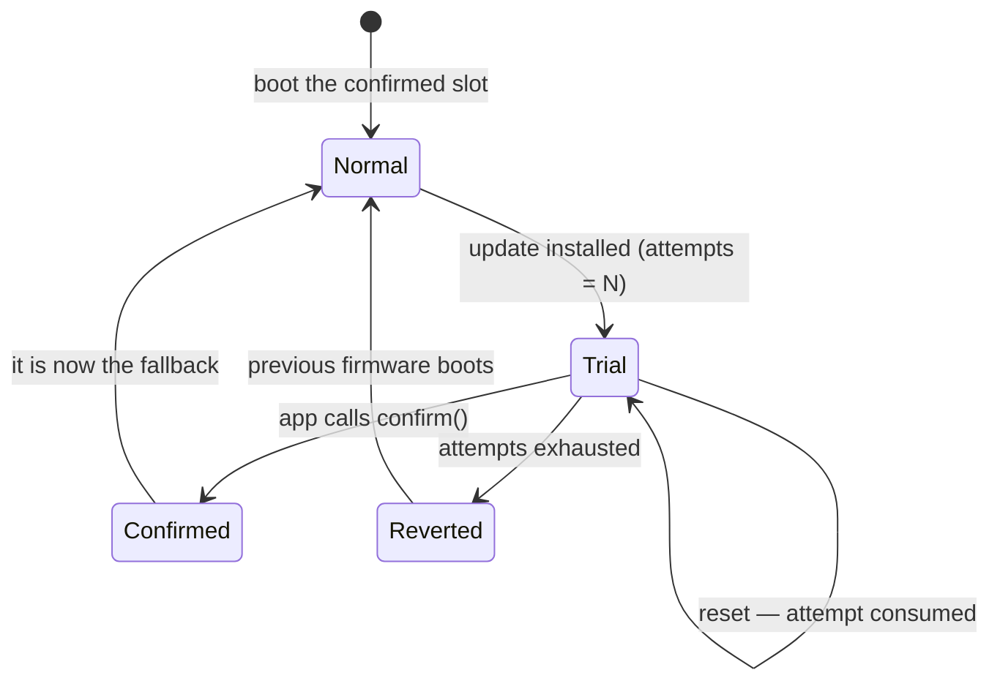

# Firmware update over UART

Shipping a product means being able to fix it after it leaves the building. alloy carries a
complete field-update path: a resident **bootloader**, two firmware **slots**, a **trial boot**
that rolls back on its own when the new firmware misbehaves, and optional **Ed25519 signing**.

Like everything else here, it is portable — the same bootloader source builds for every family
whose flash controller alloy models, and the slot layout is *computed from chip data*, never
hand-written.

```console
$ alloy keygen -o keys/update.key          # once, per product
$ alloy build --slot bl && alloy flash     # the bootloader, programmed with a probe
$ alloy image build/app.elf --set-version 2 --sign keys/update.key -o app_b.img
$ alloy update --image-b app_b.img --port /dev/tty.usbmodem1103
  42496/42496 B (100%)
update accepted -> slot B (device was running version 1); device now reboots
into a TRIAL boot — it must be confirmed to stick
```

## The layout comes from the chip data

Flash is partitioned into four regions. The CLI derives them from the flash size and the erase
granularity of the flash-controller IP — facts already in the device database — and emits them
as `alloy/slots.hpp`:

```
[ bootloader ][ slot A ][ slot B ][ boot-state store ]
```

| Board | Erase stride | Bootloader | Slot A | Slot B | Store |
| --- | --- | --- | --- | --- | --- |
| `nucleo_g071rb` (128 KB) | 2 KB page | 32 KB @ `0x08000000` | 46 KB @ `0x08008000` | 46 KB @ `0x08013800` | 4 KB |
| `nucleo_f722ze` (512 KB) | 128 KB sector | 32 KB @ `0x08000000` | 128 KB @ `0x08020000` | 128 KB @ `0x08040000` | 32 KB |
| `same70_xplained` (2 MB) | 8 KB block | 32 KB @ `0x00400000` | 1000 KB @ `0x00408000` | 1000 KB @ `0x00502000` | 16 KB |

Two decisions in that table are worth knowing about, because they are permanent once a device is
in the field:

!!! info "The bootloader region is 32 KB even when you don't sign"
    The UART bootloader itself is around 4 KB. Ed25519 verification costs ~14 KB more on
    Cortex-M0+. The region is sized for signing **whether or not a given build signs**, because
    the layout is baked into fielded devices: if turning signing on later moved the slots,
    already-deployed products could never accept the update that introduces it. Address space is
    cheap; a bricked fleet is not.

!!! info "No image swap — apps run from the slot they were written to"
    The active slot *is* the known-good fallback. An update lands in the other slot and boots
    from there directly. That removes the swap algorithm (and its power-loss states) entirely,
    at the cost of linking the app twice — see below.

The app's vector table sits at a fixed `0x200` offset inside its slot, so the updater can stream
`[header | payload]` straight into flash with the vectors landing where the bootloader's jump
expects them.

## Build the three binaries

```console
$ alloy build --slot bl      # the bootloader → its own region
$ alloy build --slot a       # your app, linked to run from slot A
$ alloy build --slot b       # the same app, linked to run from slot B
```

Because there is no swap, an app is position-dependent: it must be linked for the slot it will
execute in. You ship **both** builds, and `alloy update` picks the right one — the device says
which slot it is about to write in its `INFO` reply.

```console
$ alloy update --image-a app_a.img --image-b app_b.img --port /dev/ttyUSB0
```

Passing both is the safe form: if the device reports a slot you did not supply an image for, the
update stops before writing anything. A single image can be passed positionally, but then you are
asserting you already know the target slot — nothing cross-checks it, and the wrong one costs a
trial boot (the rollback saves the device; the update cycle is wasted).

## Pack an image

```console
$ alloy image build/app.elf --set-version 3 -o app_b.img
image: app_b.img  (42496 B = 32 B header + 42464 B payload, version 3)
```

`alloy image` accepts an ELF directly (it flattens it exactly the way `objcopy -O binary` does)
or a raw `.bin`, and wraps it in a 32-byte header:

| Offset | Field | Notes |
| --- | --- | --- |
| 0 | magic `"ALOY"` | fast-rejects erased (`0xFF`) flash |
| 4 | header version / size | lets the header grow without breaking old devices |
| 8 | `image_version` | monotonic — `--set-version`, reported back by the device |
| 12 | `payload_length` | exact bytes to CRC; never CRC a whole slot |
| 16 | `payload_crc32` | integrity of the firmware itself |
| 20 | flags, reserved | |
| 28 | `header_crc32` | so a corrupt header is rejected *before* its length is trusted |

Two independent CRCs is not belt-and-braces: the header CRC is what makes `payload_length`
trustworthy enough to use as a bound.

## Trial, confirm, rollback

A new image is armed as a **one-shot trial**. The bootloader consumes one attempt *before*
jumping, so a firmware that hangs cannot retry forever. The app must call `confirm()` after its
own health check; if it never does, the bootloader reverts to the previous firmware.



The whole state — active slot, pending slot, attempts left — packs into one 32-bit word, so any
transition commits in a **single store write**. There is no half-updated state to tear, and the
store itself is a two-page ping-pong whose write leaves the previous value authoritative if power
drops mid-write.

On the app side that is three lines ([`examples/ota_app`](https://github.com/Alloy-Embedded/alloy/tree/main/examples/ota_app)):

```cpp
using flash_hal = alloy::hal::flash_impl<alloy::slots::flash_ctrl_t>;
alloy::ota::boot_store<flash_hal> store{flash_hal{}, alloy::slots::store_base,
                                        alloy::slots::store_page_b};
alloy::ota::boot_manager mgr{store};
if (mgr.confirm()) { uart.write("confirmed\r\n"); }   // idempotent on normal boots
```

!!! warning "Reaching `main()` is not health"
    `confirm()` is a promise that *this firmware works*. Call it after the check that would
    actually catch a bad build — the sensor answered, the radio associated, the calibration
    loaded. Confirming at the top of `main()` gives you the ceremony of rollback with none of the
    protection.

### A hung trial is a reset, not a wedge

Attempts are only consumed across resets, so firmware that hangs without crashing would sit there
forever. The bootloader closes that gap: before a **trial** jump — and only a trial jump — it
arms the hardware watchdog.

```cpp
if constexpr (board::caps::watchdog) { board::watchdog.start(std::chrono::seconds{2}); }
```

A healthy app confirms and keeps feeding. A hung one is reset, consumes an attempt, and the fleet
rolls back on its own with nobody pressing anything. Confirmed boots are *not* armed by the
bootloader — that is the product's policy, not the bootloader's.

## Anti-brick doctrine

Four rules, all enforced in the bootloader rather than documented and hoped for:

1. **Verify what you boot, not just what you wrote.** The slot is verified again at boot, with
   the same code path the updater used.
2. **A trial that fails verification is rejected immediately**, not retried until attempts run
   out.
3. **If nothing verifies, stay in update mode.** A blank or fully corrupt board keeps listening
   on the same wire it was updated over — there is no state that requires a probe to escape.
4. **Verify then arm, in that order.** A crash between the two leaves `pending == none`, so the
   confirmed firmware still boots.

## Signing

Integrity (CRC) proves the image arrived intact. It proves nothing about *who sent it*. If your
update path is a service technician's laptop, a phone app, or anything reachable by someone you
have not met, sign the images.

=== "1. Make a keypair"

    ```console
    $ alloy keygen -o keys/update.key
    private key: keys/update.key  (0600 — KEEP THIS SECRET AND BACKED UP: lose it
    and fielded devices can never be updated again)
    public key:  keys/update.pub
    ```

=== "2. Tell the project its public key"

    ```toml title="alloy.toml"
    [ota]
    public_key = "keys/update.pub"
    ```

    Codegen bakes it into `alloy/ota_key.hpp`. The header is emitted either way, so firmware
    selects the policy with `if constexpr (alloy::ota_key::configured)` — no `#ifdef`, in
    keeping with the rest of the framework.

=== "3. Sign each image"

    ```console
    $ alloy image build/app.elf --set-version 3 --sign keys/update.key -o app_b.img
    ```

The signature is an Ed25519 trailer over exactly the bytes the device already verifies
(header + payload), using [Monocypher](https://monocypher.org/). Nothing about the v1 image
format changed, so the format did not fork when signing arrived.

A signing-enabled device refuses an unsigned or wrongly-signed image **on the wire** — the
operator sees a NAK — rather than accepting it and burning a trial boot on firmware it was never
going to run.

!!! danger "Keep the private key out of the repository"
    `alloy keygen` writes the private key with a `.pub` sibling; commit only the `.pub`. Anyone
    holding the private key can update every device that trusts it.

### What signing does and does not buy you

| Threat | Covered? |
| --- | --- |
| Corrupted transfer | Yes — CRC, before any signature work |
| Attacker-authored firmware | Yes — they cannot produce a valid signature |
| Tampering with an image in transit, CRCs repaired | Yes — this is a CI test case |
| Replaying an **older, genuinely signed** image | **No** — `image_version` is carried and reported, but the device does not yet refuse a downgrade |
| Key compromise | **No** — one public key is baked in; there is no rotation or revocation yet |
| Reading firmware off the device | No — signing is authenticity, not confidentiality |

## The wire protocol

Stop-and-wait, every frame CRC-32 guarded, and deliberately dull:

```
SOF 0x7E | type u8 | seq u8 | len u16 | payload[len] | crc32 u32
                     └────── crc32 covers type..payload ──────┘

host → device:  HELLO · DATA · FINISH
device → host:  INFO  · ACK  · NAK
```

The device is a pure responder — **all** retransmission policy lives in the host. A duplicate
`DATA` sequence number (a retransmit after a lost ACK) is re-ACKed without rewriting flash;
anything else out of order is NAKed. A fresh `HELLO` restarts the session, which is what makes a
host retry after a power blip mid-transfer safe.

The receiver is sans-IO: it owns no UART, no clock and no flash. Bytes are pushed in, replies come
out through a callable. That is why it can be host-tested exhaustively, and why the same receiver
works from a bootloader or from a running application.

!!! note "The update window"
    After reset the bootloader listens for ~500 ms, extended to 3 s by any traffic, then boots the
    app. `alloy update` retries `HELLO` several times, so the normal procedure is: start the
    command, then reset the device — the retry lands inside the window and the session begins.
    (An application can also reboot itself into the window on command, which is how a product with
    no reset button gets updated.)

## What this is proven against

The whole lifecycle runs in CI, on emulated hardware, as a **blocking gate** — install → trial
boot → confirm → survive a power cycle → install a bad app → three watchdog self-resets →
autonomous rollback, driven by the real `alloy update` client over a real serial link, on all
three flash families. The signing gate adds three cases: a correctly signed image boots, a
tampered image with both CRCs repaired is rejected, and an image signed by the wrong key is
rejected. Both rejections land the device back in update mode.

See [Emulation](emulation.md) for how that harness works.

!!! warning "Honest status"
    The three flash drivers (STM32G0, STM32F7 sector, SAME70 EEFC page-latch) are proven against
    faithful emulated flash controllers and by construction, **not yet on silicon**. Chips whose
    flash controller alloy does not model — RP2040 and ESP32 today — get no slot layout at all
    rather than a guessed one, so `--slot` simply is not offered for them.
