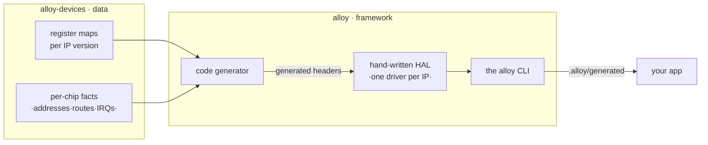

# Architecture

alloy is deliberately small and opinionated. One rule explains most of the design.

## The governing rule

!!! quote "Facts are generated. Behavior is hand-written."

    **Facts** — addresses, register offsets, bit positions, pin routes and AF numbers, clock
    gates, IRQ numbers, memory sizes, vector tables, linker layouts — live in the
    [`alloy-devices`](https://github.com/Alloy-Embedded/alloy-devices) data repository and reach
    C++ *only* through code generation.

    **Behavior** — driver sequencing, quirks, errata handling, the reset handler, API design —
    is human-written code that consumes generated facts *by name*.

This split is why adding a chip that reuses known peripheral IP costs **zero new C++**, and why
no hex address ever appears in a hand-written file (a CI gate enforces it).

## Two repositories, one story



The generator emits typed register overlays (`offsetof`-verified), per-chip instance
descriptors, typed pin-route tables, vector tables and linker scripts into a gitignored
`.alloy/` tree. Hand-written drivers are selected by an IP **type tag**, so exactly one driver
serves every chip that shares an IP:

```cpp
template <class Inst>
    requires std::same_as<typename Inst::ip, alloy::ip::st::usart_v4>
struct uart_impl<Inst> { /* ... */ };
```

## What the design guarantees

- **No heap, no exceptions, no RTTI** in firmware — the build injects `-fno-exceptions
  -fno-rtti`, and the HAL uses no `new`/`malloc`.
- **Zero-cost abstractions** — handles are empty types, dispatch is static; the portability
  layer adds no vtables.
- **Honest compile-time claims** — a wrong pin route is a `static_assert` that names the pin;
  this is a CI acceptance test, checked on every push.
- **CI executes, not just compiles** — firmware is booted under Renode and asserted on real
  UART output for the boards Renode models.

## Escaping the HAL

When the HAL doesn't yet cover a peripheral, you are not stuck. The generated register overlays
are fully typed and addressable, so you can drop to registers for one block and keep everything
else in the framework:

```cpp
#include <alloy/device.hpp>            // generated typed overlays

using gpio  = alloy::dev::gpioa_t::ip;                        // alloy::ip::st::gpio_v2
auto& regs = *reinterpret_cast<gpio::regs*>(alloy::dev::gpioa_t::base);
regs.BSRR  = std::uint32_t{1} << 5;                           // set PA5
```

The names are your chip's, not the framework's: `alloy::dev::` carries exactly the instances
your part has, so this sample is an STM32 sample and a die without a `gpioa` will not compile it.
That is the intended failure — the escape hatch is typed all the way down. The full treatment,
including the two other routes and what each one costs you, is in
**[Escaping the HAL](../guide/escape-hatch.md)**.

Facts stay generated; you only add the behavior you need.
